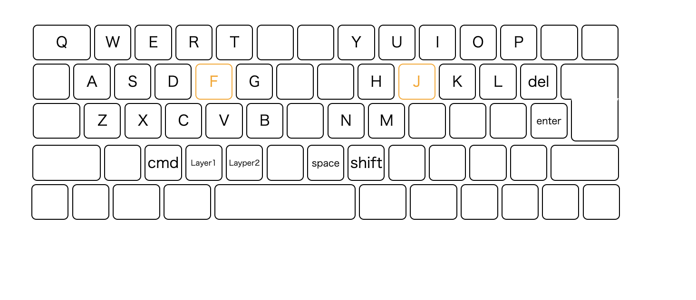
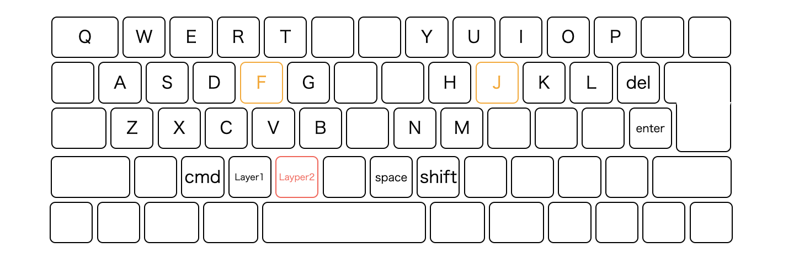
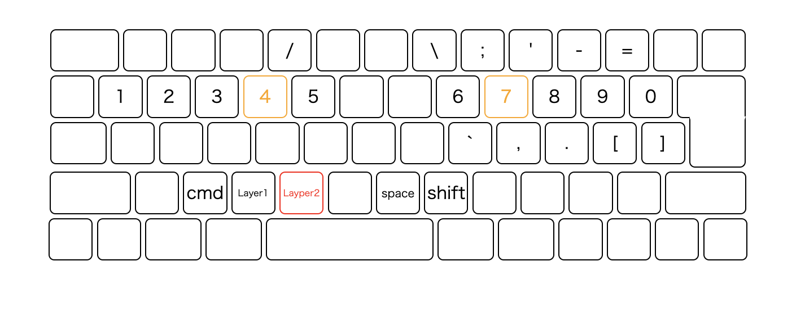
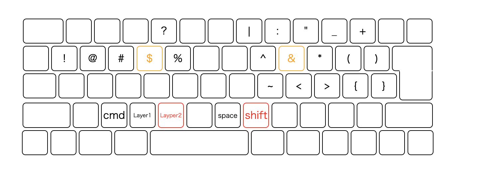
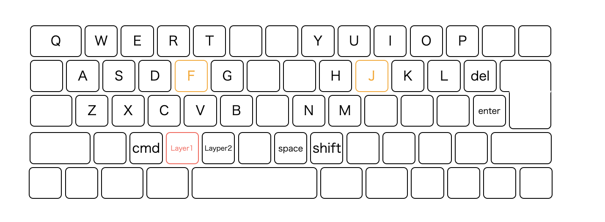
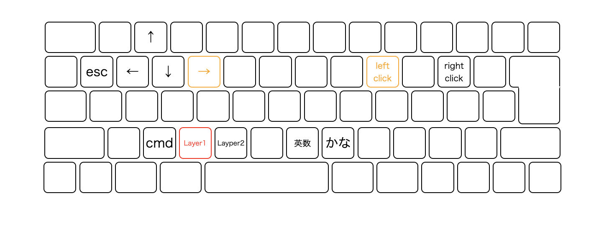
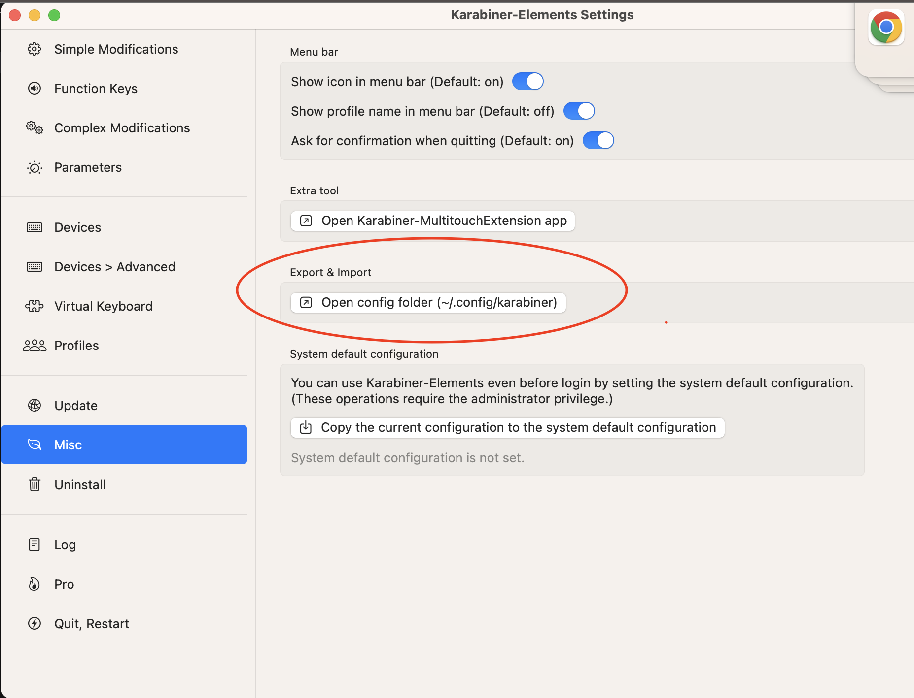
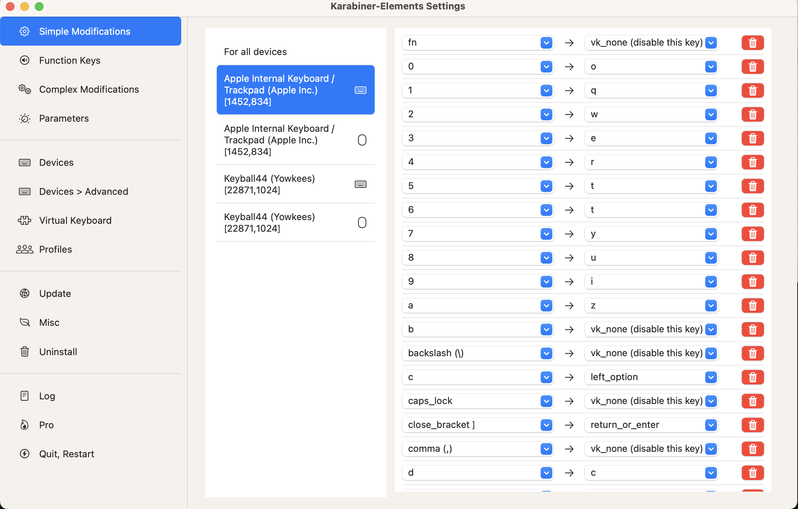

# 武蔵配列

## 基本配列

## レイヤー 2

## レイヤー 2 ＋ shift キー

## レイヤー 1

このガイドでは、武蔵配列の Karabiner 設定を導入する手順を説明します。

## 前提条件

1. macOS 10.12 以降がインストールされていること。
2. Karabiner Elements がインストールされていること。

## インストール手順

1. このリポジトリをクローンするか、ZIP ファイルとしてダウンロードして解凍します。

2. Karabiner-Elements をインストールする
   

3. Karabiner-Elements を開き、「Misc」の「Export & Inport」からダウンロードした karabiner.json をアップロードする

   

設定が反映されていれば OK

